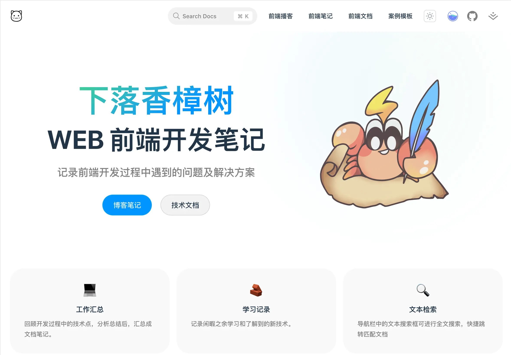
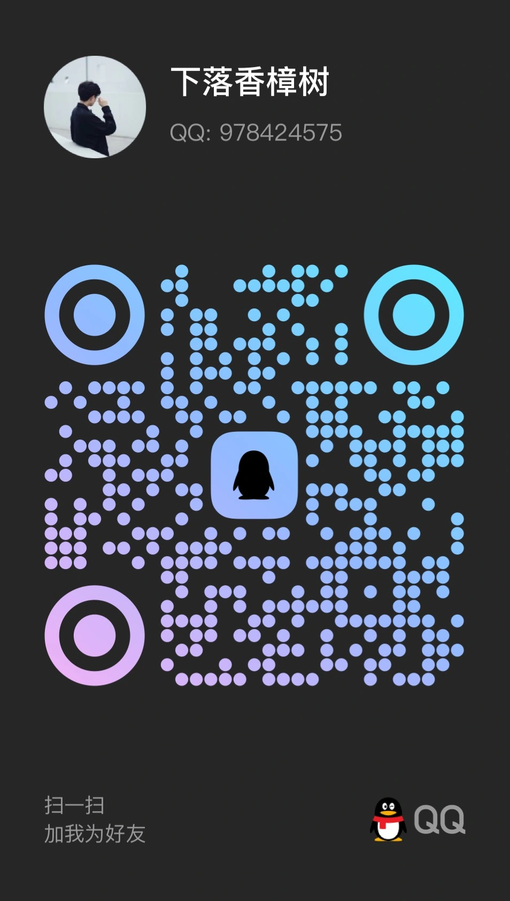

# V2Case

Vue2 开发案例

### 项目架构

vite5 + vue2 + vue-router3 + pinia + elementUI

### 依赖安装

```
yarn install
```

### 项目启动

```
yarn dev
```

### 项目构建

```
yarn build
```

### 相关文档

-   [Vite](https://cn.vitejs.dev)
-   [Vue](https://v2.cn.vuejs.org)
-   [Vue Router](https://v3.router.vuejs.org/zh)
-   [Pinia](https://pinia.vuejs.org/zh)
-   [Element-ui](https://element.eleme.cn/#/zh-CN)

### 我的博客

[](https://zxkv.github.io)

### 联系方式

📮：<zxkang@88.com>


